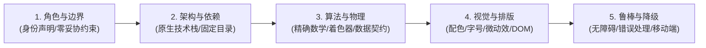

# KIMI Web Artifacts & Prompt Engineering Showcase
### 🚀 KIMI 官方前沿前端案例、专业提示词工程与成品源码全景库

<p align="center">
  
  
  
  
  
</p>

---

## 📖 项目简介

本项目收录并整理了 **Moonshot AI（月之暗面）Kimi 官网** 及 **Kimi Agent / K3** 在前端应用生成领域的最前沿官方展示案例，包含：

1. **🌐 91 个官方在线演示站点**：涵盖游戏娱乐、3D 可视化、金融专业看板、交互式研报、实用工具及落地页；
2. **🧠 9 套官方公开的万字系统提示词（Prompt Specs, Markdown）**：解密如何通过精细的工程级规格提示词，让 AI 一次性生成生产级、复杂图形学与数据可视化单页应用；
3. **📦 9 套完整可运行前端成品项目源码（ZIP Packages）**：包含开箱即用的静态前端代码、着色器脚本、素材资源与测试验收报告。

无论是研究 **大模型前端代码生成能力边界**，还是学习 **复杂应用 Prompt 架构设计**，本项目都具备极高的参考价值。

---

## 🌟 核心亮点

- 📐 **超硬核提示词工程（Prompt Engineering Specs）**：单份 Prompt 篇幅达 20KB~90KB，详尽规范了架构选型、DOM 结构、WebGL/TSL 数学方程、物理模拟因果链、状态机以及降级兜底方案。
- ⚡ **纯原生技术栈（Zero-Build / Vanilla First）**：生成的应用普遍采用原生 HTML5 + ES Modules + 本地依赖引入，摆脱庞大的 npm 构建流程，本地双击或简易静态服务器即可秒级秒开。
- 🎨 **前沿图形与数据可视化**：深度覆盖 WebGPU (TSL 节点着色器)、Three.js 实时光线追踪 (GLSL)、D3.js 滚动叙事 (Scrollytelling)、Canvas 金融终端与 3D 骨骼动画游戏物理。

---

## 📂 仓库文件组织

本仓库按照清晰的职能进行分层归类，开箱即用：

```
.
├── 📜 README.md                                                 # 项目总览与使用说明 (本文档)
├── 📑 KIMI官网展示案例汇总.md                                       # 全量 91 个官方案例全景分类导航与清单
│
├── 📁 prompts/                                                  # 系统提示词规格文件目录 (Markdown 格式)
│   ├── GARGANTUA.md                                            # 黑洞 WebGL 光线追踪 Prompt (38KB)
│   ├── 3D复古打字机.md                                         # 3D 机械打字机交互 Prompt (42KB)
│   ├── Bloomberg风格全球股市看板.md                             # 金融终端 Canvas 监控 Prompt (56KB)
│   ├── 海的尽头.md                                             # WebGPU/TSL 海洋模拟 Prompt (21KB)
│   ├── 赛博朋克大都会.md                                       # Web 3D 动作游戏 Prompt (23KB)
│   ├── 喷气发动机3D互动教具.md                                 # 机械航空工程 3D 课本 Prompt (37KB)
│   ├── 推理芯片的四十二年 · 1985–2026 周期重建与行业深研.md    # 芯片长卷研报 Prompt (68KB)
│   ├── 用注意力重塑深度维度的信息聚合 · 交互讲解.md            # 注意力机制互动科普 Prompt (92KB)
│   └── 船运不是一个周期.md                                     # D3 海运数据叙事 Prompt (18KB)
│
└── 📁 packages/                                                 # 成品项目源码包目录 (ZIP 压缩包)
    ├── Kimi_Agent_✅GARGANTUA.zip                               # 黑洞项目完整源码包
    ├── Kimi_Agent_3D复古打印机.zip                              # 3D 打字机完整源码包
    ├── Kimi_Agent_全球股市终端构建.zip                          # 彭博股票终端完整源码包
    ├── Kimi_Agent_✅Open Sea.zip                                # WebGPU 海洋模拟源码包
    ├── cyberpunk-megapolis-v7.zip                               # 赛博朋克游戏完整源码及模型资源
    ├── Kimi_Agent_3D喷气发动机教学.zip                          # 喷气发动机教具完整源码及素材
    ├── Kimi_Agent_✅推理芯片.zip                                # 芯片研报完整源码及图表脚本
    ├── Kimi_Agent_✅论文.zip                                    # 交互论文讲解完整单页应用
    └── Kimi_Agent_✅船运周期.zip                                # 航运数据叙事完整源码及数据集
```

---

## 💎 九大核心案例与工程文件成品

本仓库核心收录了 9 个由顶级提示词驱动、由 Kimi Agent 生成的旗舰级前端单页项目，每套均包含**【完整系统提示词 `.md`】**与**【完整源码成品 `.zip`】**：

| 序号 | 案例名称 | 核心领域 | 关键技术栈 | Prompt 文件 | 完整项目成品源码包 | 官网在线体验直达 |
| :---: | :--- | :--- | :--- | :--- | :--- | :--- |
| **01** | **黑洞：GARGANTUA** | 科学可视化 / 天体物理 | WebGL, GLSL, Three.js, Raytracer | [`GARGANTUA.md`](./prompts/GARGANTUA.md) | [`Kimi_Agent_✅GARGANTUA.zip`](./packages/Kimi_Agent_✅GARGANTUA.zip) | [🌐 在线预览 1](https://c3gyemkuxznvi.ok.kimi.link?id=2077777306876747776&share_id=19f6af0a-ddb2-8cce-8000-0000238a274d) / [预览 2](https://excdvtcdshcu4.ok.kimi.link/) |
| **02** | **3D 复古打字机** | 拟物拟态 / 3D 交互 | Three.js, 物理按键音效, 纸张卷动 | [`3D复古打字机.md`](./prompts/3D复古打字机.md) | [`Kimi_Agent_3D复古打印机.zip`](./packages/Kimi_Agent_3D复古打印机.zip) | [🌐 在线预览 1](https://ixb5rkvzh7m44.ok.kimi.link?id=2082736037805252608&share_id=19fb1fad-6ce2-8a42-8000-0000a90284a2) / [预览 2](https://phfiw57ydjife.kimi.page/) |
| **03** | **Bloomberg 风格全球股市看板** | 金融科技 / 交易终端 | Canvas, ASCII Terminal, 模块化拖拽 | [`Bloomberg风格全球股市看板.md`](./prompts/Bloomberg风格全球股市看板.md) | [`Kimi_Agent_全球股市终端构建.zip`](./packages/Kimi_Agent_全球股市终端构建.zip) | [🌐 在线预览 1](https://6qz4trpct4e34.ok.kimi.link?id=2082747077238546432&share_id=19fb223c-87f2-83c7-8000-0000a60c211b) / [预览 2](https://s4ibp54hd7bwq.kimi.page/) |
| **04** | **海的尽头 (Open Sea)** | 次世代 Web 图形学 | WebGPU, Three.js TSL 节点着色器 | [`海的尽头.md`](./prompts/海的尽头.md) | [`Kimi_Agent_✅Open Sea.zip`](./packages/Kimi_Agent_✅Open%20Sea.zip) | [🌐 在线预览 1](https://avj2vp5rk3fqe.ok.kimi.link?id=2077778172904054784&share_id=19f6af1a-b402-8a62-8000-0000ed366eab) / [预览 2](https://qdtipu6rd2myk.ok.kimi.link) |
| **05** | **赛博朋克大都会** | 3D Web 动作游戏 | Three.js, 骨骼动画, 蛛丝飞跃物理 | [`赛博朋克大都会.md`](./prompts/赛博朋克大都会.md) | [`cyberpunk-megapolis-v7.zip`](./packages/cyberpunk-megapolis-v7.zip) | [🌐 在线预览 1](https://dnjwep22axoiq.ok.kimi.link?id=2077778637939122176&share_id=19f6aedd-c7a2-862d-8000-0000ba25e56c) / [预览 2](https://zrlxxdaz56kym.ok.kimi.link) |
| **06** | **喷气发动机 3D 互动教具** | 航空航天 / 机械课本 | Three.js, 布雷顿循环, 粒子流体模拟 | [`喷气发动机3D互动教具.md`](./prompts/喷气发动机3D互动教具.md) | [`Kimi_Agent_3D喷气发动机教学.zip`](./packages/Kimi_Agent_3D喷气发动机教学.zip) | [🌐 在线预览](https://wa6krm6bznv44.kimi.page) |
| **07** | **推理芯片的四十二年 (1985–2026)** | 深度研究长卷研报 | ASIC V8 复刻, 滚动叙事, 实时仪表盘 | [`推理芯片的四十二年 · 1985–2026 周期重建与行业深研.md`](./prompts/推理芯片的四十二年%20·%201985–2026%20周期重建与行业深研.md) | [`Kimi_Agent_✅推理芯片.zip`](./packages/Kimi_Agent_✅推理芯片.zip) | [🌐 在线预览](https://765dvagfhthwu.kimi.page) |
| **08** | **Attention Residuals 交互论文精读** | AI 论文互动科普 | 交互式架构讲解, 状态演进, SVG 动效 | [`用注意力重塑深度维度的信息聚合 · 交互讲解.md`](./prompts/用注意力重塑深度维度的信息聚合%20·%20交互讲解.md) | [`Kimi_Agent_✅论文.zip`](./packages/Kimi_Agent_✅论文.zip) | [🌐 在线预览](https://7inif7p6jcz2y.kimi.page) |
| **09** | **船运不是一个周期** | 宏观数据故事化 | D3.js v7, Scrollama v3, 像素船 SVG | [`船运不是一个周期.md`](./prompts/船运不是一个周期.md) | [`Kimi_Agent_✅船运周期.zip`](./packages/Kimi_Agent_✅船运周期.zip) | [🌐 在线预览](https://nuesj4c5tehcg.kimi.page) |

---

## 🔬 案例深度拆解

<details>
<summary><b>1. 黑洞：GARGANTUA（点击展开详情）</b></summary>

- **项目定位**：实时 Schwarzschild 黑洞光线追踪模拟器，致敬《星际穿越》。
- **图形学实现**：纯 GLSL 片段着色器实时计算引力透镜偏折方程与事件视界，结合多重采样吸积盘粒子渲染，配备电影级 HUD、音效系统与参数控制面板。
- **Prompt 亮点**：严禁采用粗糙的“黑色 3D 球体+扁平光环贴图”糊弄方案，以物理数学规范约束光线步进算法。
</details>

<details>
<summary><b>2. 3D 复古打字机（点击展开详情）</b></summary>

- **项目定位**：高保真拟物化机械打字机 3D 互动体验。
- **核心交互**：完整按键行程回弹动画、联动字锤敲击、移动滚筒走纸、换行蜂鸣与机械清脆音效。
- **Prompt 亮点**：精细定义按键敲击状态机（Key Down -> Strike Lever -> Ribbon Advance -> Paper Feed）。
</details>

<details>
<summary><b>3. Bloomberg 风格全球股市看板（点击展开详情）</b></summary>

- **项目定位**：高信息密度全球多资产交易监控工作台（彭博终端 × ASCII 艺术风）。
- **核心功能**：支持全球股指热力图、AAPL 历史走势、四大贵金属实时联动、五大多时区开盘时钟，具备类 Canvas 画布的模块拖拽重排与本地持久化。
- **Prompt 亮点**：强调高密度金融终端排版，严禁做成常见 SaaS 风格的大圆角空旷后台。
</details>

<details>
<summary><b>4. 海的尽头 · Open Sea（点击展开详情）</b></summary>

- **项目定位**：基于次世代 WebGPU 规范的程序化海洋与天际模拟。
- **图形学实现**：采用 Three.js Shading Language (TSL) 节点着色器，实时 Gerstner 波浪物理运算、次表面散射与水下折射。
- **Prompt 亮点**：规定双文件纯原生架构（`index.html` + `main.js`），严密实现 WebGPU 检测、平滑降级与 FPS 监控。
</details>

<details>
<summary><b>5. 赛博朋克大都会 · Web-Swing Edition（点击展开详情）</b></summary>

- **项目定位**：浏览器端全 3D 第三人称赛博都市蛛丝穿梭高动感游戏。
- **技术特色**：包含数百座建筑的城市体块生成、GLTF 角色与多套动作融合、蛛丝摆荡物理系统、第三人称跟随电影镜头。
- **Prompt 亮点**：精确规定电影级黑色 Loader 动画时序与资源真实加载进度计算，防止假加载。
</details>

<details>
<summary><b>6. 喷气发动机 3D 互动教具（点击展开详情）</b></summary>

- **项目定位**：机械工程/航空航天专业低年级立体互动课本。
- **因果链设计**：将“进气 → 压气机增压 → 燃烧室膨胀 → 涡轮做功 → 喷管加速推力”完整物理与热力学布雷顿循环可视化。
- **Prompt 亮点**：每一个机械零部件均与状态参数双向绑定，支持剖切、定格与气流色彩温标展示。
</details>

<details>
<summary><b>7. 推理芯片的四十二年（点击展开详情）</b></summary>

- **项目定位**：1985-2026 全球 AI 与计算芯片周期深度图文研报。
- **交互设计**：复刻 ASIC V8 经典长卷，滚动触发故事线（Scrollytelling），右侧悬浮固定 Dashboard 同步联动展现周期指数与算力能效比。
</details>

<details>
<summary><b>8. Attention Residuals 交互论文精读（点击展开详情）</b></summary>

- **项目定位**：前沿 AI 架构论文科普——用注意力重塑深度维度的信息聚合。
- **交互设计**：将复杂的残差连接稀释、Full Attention Residuals 与 Block Attention Residuals 用可交互的矩阵流行动画生动拆解。
</details>

<details>
<summary><b>9. 船运不是一个周期（点击展开详情）</b></summary>

- **项目定位**：宏观经济与集装箱海运波动的交互式数据新闻。
- **技术特色**：原生 D3.js + Scrollama，采用字符矩阵生成矢量像素船模型，清晰呈现多周期叠加规律。
</details>

---

## 🧠 提示词工程（Prompt Engineering）方法论启示

研读本仓库中收录的 9 篇 Prompt，可以总结出让 AI Agent 一次性高质量交付复杂系统的**“五步工业级 Prompt 范式”**：



1. **绝对边界与前置声明**：明确规定“严禁向用户索要源码、严禁使用静态伪图敷衍、严禁输出占位 TODO 代码”。
2. **纯粹的技术栈契约**：明确指定单文件或原生 ES Modules 方案，约定固定的加载顺序与本地依赖路径，杜绝构建链断裂风险。
3. **算法与物理底层公式**：将天体物理、热力学循环、Gerstner 波、金融指标等公式直接作为 Prompt 的事实来源注入。
4. **精细到像素的视觉规范**：从背景色十六进制码、字体排印层级到微交互动画帧均有详尽规格，极大减少 AI 的随意自由发散。
5. **健壮的状态机与优雅降级**：预置 WebGPU/WebGL 缺失环境检测与备用渲染管线，确保在各端均有良好可访问性。

---

## 🌐 官网 91 个全量案例分类导航

> 全量分类导航与详细链接请查阅专用文档：[`KIMI官网展示案例汇总.md`](./KIMI官网展示案例汇总.md)。

- **精选网站 (65 个)**：
  - 🎮 **游戏娱乐 (9 个)**：月光钢琴、海岛世界、运河极速、传送战场、月面竞速、赛博战机、霜林博弈、沙暴协议、月面疾跑
  - 📊 **数据与科学可视化 (14 个)**：三维设计、爆炸视图、交互研报、文字绕流、彩色研报、挑战路书、知识星图、概念图解、代码之城、仓库观测、讲解工坊、时间长河、智能编队、场实验室
  - 🖥️ **专业与业务看板 (9 个)**：班级管理、盘面看板、指挥大屏、管理后台、数据手稿、预算台账、运维终端、库存蓝图、客户台账
  - 🛠️ **效能与创作工具 (9 个)**：雨窗手记、抽奖转盘、论文精读、投票看板、每日待办、思维导图、在线题册、图片暗房、计算工台
  - 📄 **创意与设计落地页 (20 个)**：竖排长卷、变幻视界、客户洞察、程序场景、一日时刻、流体工场、旅行影集、编年档案、时装店面、节气笺纸、物件目录、温泉汤宿、全息画廊、落日旅途、艺术藏馆、幻夜疾驰、光影空间、字符暗月、赛博雨幕、流动印象
  - 🌐 **全栈与独立应用 (4 个)**：个人博客、专注空间、海景预定、月光笔记
- **Agent 集群展示案例 (5 个)**：黑洞 GARGANTUA、3D 复古打字机、Bloomberg 风格全球股市看板、海的尽头、赛博朋克大都会
- **探索灵感已发布作品 (21 个)**：涵盖灵感、智能体集群、深度研究、精选网站、交互文档与表格 6 大产品线

---

## 🚀 本地运行与体验指南

由于项目中包含 WebGL、WebGPU 以及 Web Audio 资源，建议通过本地静态 Web 服务器运行，避免直接双击 `file://` 引发的浏览器 CORS 跨域限制。

### 快速启动步骤：

1. **克隆本仓库到本地**：
   ```bash
   git clone https://github.com/9E307/awesome-kimi-k3-frontend-prompt.git
   cd awesome-kimi-k3-frontend-prompt
   ```

2. **解压目标项目的 ZIP 压缩包**（例如解压黑洞项目）：
   ```powershell
   # Windows PowerShell 示例
   Expand-Archive -Path "packages/Kimi_Agent_✅GARGANTUA.zip" -DestinationPath "./gargantua"
   ```

3. **启动简易本地静态服务器**（任选一种常用方式）：
   - **Node.js (npx)**：
     ```bash
     npx serve ./gargantua
     ```
   - **Python 3**：
     ```bash
     python -m http.server 8080 --directory ./gargantua
     ```
   - **VS Code**：安装 `Live Server` 插件后右键 `index.html` 选择 **"Open with Live Server"**。

4. **打开现代浏览器体验**：
   - 访问控制台提示的地址（如 `http://localhost:8080`）；
   - **注意**：体验 WebGPU 案例（如《海的尽头》）需使用支持 WebGPU 的最新版 Chrome/Edge/Firefox，并在设置中开启硬件加速。

---

## 📌 免责声明与版权说明

1. 本项目所整理之演示链接、提示词及成品源码均来自 [Moonshot AI (Kimi)](https://www.kimi.com) 官方公开展示与生成示例。
2. 相关技术专利、品牌商标及作品版权归原权利人 **Moonshot AI（北京月之暗面科技有限公司）** 所有。
3. 本项目仅供前端开发者、AI 研究人员及对 Prompt Engineering 感兴趣的学习者进行学术研究与技术交流，请勿用于任何商业用途。

---

<p align="center">
  如果这个项目对你理解 <b>AI Agent 代码生成</b> 与 <b>提示词工程</b> 有所帮助，欢迎点亮右上角 ⭐ <b>Star</b> 予以支持！
</p>
