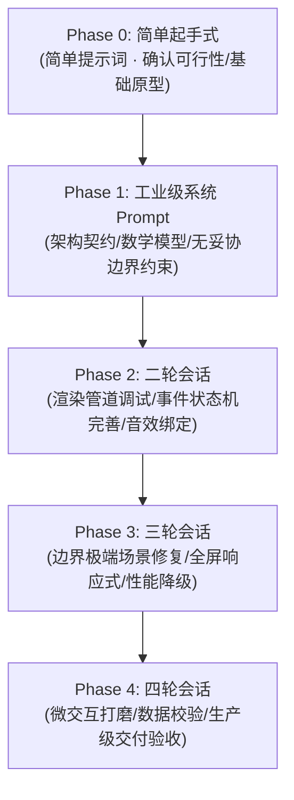

# KIMI Web Artifacts & Prompt Engineering Showcase
### 🚀 KIMI 官方前沿前端案例、工业级提示词工程、多轮会话实录与成品源码全景库

<p align="center">
  
  
  
  
  
</p>

---

## 📖 项目简介

本项目深度收录并系统整理了 **Moonshot AI（月之暗面）Kimi 官网**、**Kimi Agent** 以及 **Kimi K3** 在前端应用生成领域的全部核心工程资产与提示词沉淀，构建了一个开箱即用的 Web 前端生成范式库：

1. **💎 9 大旗舰级工程工件（Core Packages）**：包含 9 套完整可离线运行的前端成品项目源码包（ZIP）、着色器源码、静态依赖与测试报告；
2. **🧠 工业级提示词工程与多轮会话实录（Multi-Turn Prompts）**：涵盖核心案例的**【简单提示词（起手式）】$\to$【主系统规格 Prompt（万字规范）】$\to$【第 2~4 轮精准微调与 Debug 会话】**，完整还原顶尖复杂应用的人机协作推演过程；
3. **💡 129 份官方灵感库独立 Prompt 资产（Inspiration Prompts）**：涵盖游戏、3D 网页、应用建站三大类，配套 **129 份独立归档的本地 Prompt 文档**（位于 [`灵感库prompt/`](./灵感库prompt/)）；
4. **🌐 183 个全量去重在线展示站点汇总（Deduplicated Showcases）**：将官网展示案例与灵感库跨库剔除 36 个重复项后，整合成 **183 个独一无二的在线演示站点**，集中收录于 [`KIMI官网展示案例汇总.md`](./KIMI官网展示案例汇总.md)。

---

## 🌟 核心亮点

- 🔄 **完整的多轮交互演进实录**：告别“盲盒式”一句话生成，真实公开让 AI 攻克 WebGL/WebGPU 3D 游戏、引力透镜光线追踪、彭博金融终端时所需的**多轮提示词拆解与调优记录**。
- 📦 **129 份官方灵感库 Prompt 资产集**：按标准数据协议同步收录了官方灵感专区的全部 129 篇 Prompt，开箱即查即用，涵盖从休闲 3D 游戏到物理仿真课件的丰富品类。
- ⚡ **纯原生免构建架构（Zero-Build / Vanilla First）**：全部工程制品均采用原生 HTML5 + ES Modules + 本地依赖引入，杜绝复杂的 npm 构建链，本地静态服务器秒级启动。
- 🎨 **前沿 Web 图形学技术覆盖**：涵盖 WebGPU (TSL 节点着色器)、Three.js 实时光线追踪 (GLSL)、D3.js 滚动叙事 (Scrollytelling)、Canvas 交易终端及 3D 骨骼动画游戏。

---

## 📂 仓库文件组织

```
.
├── 📜 README.md                                                 # 项目总览与使用说明 (本文档)
├── 📑 KIMI官网展示案例汇总.md                                       # 官方全量展示案例汇总 (全量去重收录 183 个独一演示站点)
│
├── 📁 prompts/                                                  # 旗舰工程多轮会话与提示词规格库 (Markdown)
│   ├── 3D复古打字机.md (+ 简单提示词 / 第二轮 / 第三轮会话)
│   ├── Bloomberg风格全球股市看板.md (+ 简单提示词 / 第2~4轮会话)
│   ├── GARGANTUA.md (+ 简单提示词 / 第二轮会话)
│   ├── 喷气发动机3D互动教具.md (+ 简单提示词 / 第2~4轮会话)
│   ├── 推理芯片的四十二年 · 1985–2026 周期重建与行业深研.md (+ 简单提示词 / 第2~4轮会话)
│   ├── 海的尽头.md (+ 简单提示词)
│   ├── 用注意力重塑深度维度的信息聚合 · 交互讲解.md (+ 第二轮会话)
│   ├── 赛博朋克大都会.md (+ 简单提示词 / 第二轮会话)
│   └── 船运不是一个周期.md
│
├── 📁 灵感库prompt/                                              # 129 个官方灵感库独立提示词文件 (Markdown)
│   ├── 3D 网页类 (太阳系漫游、透视火箭标注图、陀飞轮手表机芯、人体解剖学堂...)
│   ├── 游戏娱乐类 (林中小屋、第一人称3D台球、午夜货运、Kimi环游世界...)
│   └── 应用建站类 (行情监控看板、通用管理后台、多轨时间轴、氛围日记本...)
│
└── 📁 packages/                                                 # 9 大核心工程可运行成品源码包 (ZIP 压缩包)
    ├── Kimi_Agent_✅GARGANTUA.zip                               # 黑洞 WebGL 光线追踪完整源码
    ├── Kimi_Agent_3D复古打印机.zip                              # 3D 打字机完整源码包
    ├── Kimi_Agent_全球股市终端构建.zip                          # 彭博股票终端完整源码包
    ├── Kimi_Agent_✅Open Sea.zip                                # WebGPU 海洋模拟源码包
    ├── cyberpunk-megapolis-v7.zip                               # 赛博朋克 3D 动作游戏完整源码及模型
    ├── Kimi_Agent_3D喷气发动机教学.zip                          # 喷气发动机立体教具完整源码及素材
    ├── Kimi_Agent_✅推理芯片.zip                                # 芯片研报完整源码及图表脚本
    ├── Kimi_Agent_✅论文.zip                                    # 交互论文讲解完整单页应用
    └── Kimi_Agent_✅船运周期.zip                                # 航运数据叙事完整源码及数据集
```

---

## 💎 九大核心案例与工程成品矩阵（含多轮 Prompt 演进）

本仓库收录了 9 套由 Kimi Agent 生成的旗舰级前端单页项目，每套均提供**【多轮会话 Prompt】**与**【完整源码成品包】**：

| 序号 | 案例名称 | 核心领域 | 关键技术栈 | 提示词与多轮会话文件 (位于 [`prompts/`](./prompts/)) | 完整项目成品源码包 | 官网在线体验直达 |
| :---: | :--- | :--- | :--- | :--- | :--- | :--- |
| **01** | **黑洞：GARGANTUA** | 科学可视化 / 天体物理 | WebGL, GLSL, Three.js, Raytracer | • [`主规格`](./prompts/GARGANTUA.md)<br>• [`简单版`](./prompts/GARGANTUA-简单提示词.md)<br>• [`第二轮`](./prompts/GARGANTUA-第二轮会话.md) | [`Kimi_Agent_✅GARGANTUA.zip`](./packages/Kimi_Agent_✅GARGANTUA.zip) | [🌐 体验 1](https://c3gyemkuxznvi.ok.kimi.link?id=2077777306876747776&share_id=19f6af0a-ddb2-8cce-8000-0000238a274d) / [体验 2](https://excdvtcdshcu4.ok.kimi.link/) |
| **02** | **3D 复古打字机** | 拟物拟态 / 3D 交互 | Three.js, 物理按键音效, 纸张卷动 | • [`主规格`](./prompts/3D复古打字机.md)<br>• [`简单版`](./prompts/3D复古打字机-简单提示词.md)<br>• [`第二轮`](./prompts/3D复古打字机-第二轮会话.md)<br>• [`第三轮`](./prompts/3D复古打字机-第三轮会话.md) | [`Kimi_Agent_3D复古打印机.zip`](./packages/Kimi_Agent_3D复古打印机.zip) | [🌐 体验 1](https://ixb5rkvzh7m44.ok.kimi.link?id=2082736037805252608&share_id=19fb1fad-6ce2-8a42-8000-0000a90284a2) / [体验 2](https://phfiw57ydjife.kimi.page/) |
| **03** | **Bloomberg 风格股市看板** | 金融科技 / 交易终端 | Canvas, ASCII Terminal, 模块化拖拽 | • [`主规格`](./prompts/Bloomberg风格全球股市看板.md)<br>• [`简单版`](./prompts/Bloomberg风格全球股市看板-简单提示词.md)<br>• [`第二轮`](./prompts/Bloomberg风格全球股市看板-第二轮会话.md)<br>• [`第三轮`](./prompts/Bloomberg风格全球股市看板-第三轮会话.md)<br>• [`第四轮`](./prompts/Bloomberg风格全球股市看板-第四轮会话.md) | [`Kimi_Agent_全球股市终端构建.zip`](./packages/Kimi_Agent_全球股市终端构建.zip) | [🌐 体验 1](https://6qz4trpct4e34.ok.kimi.link?id=2082747077238546432&share_id=19fb223c-87f2-83c7-8000-0000a60c211b) / [体验 2](https://s4ibp54hd7bwq.kimi.page/) |
| **04** | **海的尽头 (Open Sea)** | 次世代 Web 图形学 | WebGPU, Three.js TSL 节点着色器 | • [`主规格`](./prompts/海的尽头.md)<br>• [`简单版`](./prompts/海的尽头-简单提示词.md) | [`Kimi_Agent_✅Open Sea.zip`](./packages/Kimi_Agent_✅Open%20Sea.zip) | [🌐 体验 1](https://avj2vp5rk3fqe.ok.kimi.link?id=2077778172904054784&share_id=19f6af1a-b402-8a62-8000-0000ed366eab) / [体验 2](https://qdtipu6rd2myk.ok.kimi.link) |
| **05** | **赛博朋克大都会** | 3D Web 动作游戏 | Three.js, 骨骼动画, 蛛丝飞跃物理 | • [`主规格`](./prompts/赛博朋克大都会.md)<br>• [`简单版`](./prompts/赛博朋克大都会-简单提示词.md)<br>• [`第二轮`](./prompts/赛博朋克大都会-第二轮会话.md) | [`cyberpunk-megapolis-v7.zip`](./packages/cyberpunk-megapolis-v7.zip) | [🌐 体验 1](https://dnjwep22axoiq.ok.kimi.link?id=2077778637939122176&share_id=19f6aedd-c7a2-862d-8000-0000ba25e56c) / [体验 2](https://zrlxxdaz56kym.ok.kimi.link) |
| **06** | **喷气发动机 3D 互动教具** | 航空航天 / 机械课本 | Three.js, 布雷顿循环, 粒子流体模拟 | • [`主规格`](./prompts/喷气发动机3D互动教具.md)<br>• [`简单版`](./prompts/喷气发动机3D互动教具-简单提示词.md)<br>• [`第二轮`](./prompts/喷气发动机3D互动教具-第二轮会话.md)<br>• [`第三轮`](./prompts/喷气发动机3D互动教具-第三轮会话.md)<br>• [`第四轮`](./prompts/喷气发动机3D互动教具-第四轮会话.md) | [`Kimi_Agent_3D喷气发动机教学.zip`](./packages/Kimi_Agent_3D喷气发动机教学.zip) | [🌐 体验](https://wa6krm6bznv44.kimi.page) |
| **07** | **推理芯片的四十二年** | 深度研究长卷研报 | ASIC V8 复刻, 滚动叙事, 实时仪表盘 | • [`主规格`](./prompts/推理芯片的四十二年%20·%201985–2026%20周期重建与行业深研.md)<br>• [`简单版`](./prompts/推理芯片的四十二年%20·%201985–2026%20周期重建与行业深研-简单提示词.md)<br>• [`第二轮`](./prompts/推理芯片的四十二年%20·%201985–2026%20周期重建与行业深研-第二轮会话.md)<br>• [`第三轮`](./prompts/推理芯片的四十二年%20·%201985–2026%20周期重建与行业深研-第三轮会话.md)<br>• [`第四轮`](./prompts/推理芯片的四十二年%20·%201985–2026%20周期重建与行业深研-第四轮会话.md) | [`Kimi_Agent_✅推理芯片.zip`](./packages/Kimi_Agent_✅推理芯片.zip) | [🌐 体验](https://765dvagfhthwu.kimi.page) |
| **08** | **Attention Residuals 互动论文** | AI 论文互动科普 | 交互式架构讲解, 状态演进, SVG 动效 | • [`主规格`](./prompts/用注意力重塑深度维度的信息聚合%20·%20交互讲解.md)<br>• [`第二轮`](./prompts/用注意力重塑深度维度的信息聚合%20·%20交互讲解-第二轮会话.md) | [`Kimi_Agent_✅论文.zip`](./packages/Kimi_Agent_✅论文.zip) | [🌐 体验](https://7inif7p6jcz2y.kimi.page) |
| **09** | **船运不是一个周期** | 宏观数据故事化 | D3.js v7, Scrollama v3, 像素船 SVG | • [`主规格`](./prompts/船运不是一个周期.md) | [`Kimi_Agent_✅船运周期.zip`](./packages/Kimi_Agent_✅船运周期.zip) | [🌐 体验](https://nuesj4c5tehcg.kimi.page) |

---

## 💡 官网灵感库精选专区 (Inspiration Hub · 129 个案例)

> 现已完整合并融入：[`KIMI官网展示案例汇总.md`](./KIMI官网展示案例汇总.md)  
> 对应 129 份独立 Prompt 文档均已归档于：[`灵感库prompt/`](./灵感库prompt/)

官方灵感库展示了 Kimi 在创意编程、互动小游戏及轻量级 Web 建站层面的敏捷生成能力，共分为三大核心专区：

| 专区分类 | 官方专区链接 | 案例数 | 特色代表案例 |
| :--- | :--- | :---: | :--- |
| 🎮 **游戏专区 (Game)** | [Inspiration / Game](https://www.kimi.com/inspiration?tab=game) | **42** | 林中小屋 (开放世界)、第一人称3D台球、午夜货运、Kimi环游世界、圣安娜祭坛浮雕、树蛙模拟器、沙漠FPS射击 |
| 🌐 **3D 网页专区 (3D Web)** | [Inspiration / 3D Web](https://www.kimi.com/inspiration?tab=3d_web) | **44** | 太阳系漫游、透视火箭标注图、陀飞轮手表机芯、人体解剖学堂、日落收藏家、古灵阁灯光控制台、空间站生活舱 |
| 🛠️ **应用建站专区 (Other)** | [Inspiration / Other](https://www.kimi.com/inspiration?tab=other) | **43** | 行情监控看板、多 Agent 可视化、与人·HR招聘系统、多轨时间轴、氛围日记本、机械臂工作流程看板、房屋火灾模拟 |

> 📁 **如何使用灵感库 Prompt**：进入 [`灵感库prompt/`](./灵感库prompt/) 目录，每份文件均包含「作品标题」、「在线体验 URL」与「完整的 Prompt 提示词」，可直接复制至 Kimi、Claude 或其他 AI Coding 工具中快速复刻生成！

---

## 🧠 多轮提示词工程（Multi-Turn Prompting）方法论启示

本次拆分出的多轮会话实录直观揭示了构建高复杂度软件时，人机协作的生命周期模型：



1. **简单提示词（Phase 0）**：验证模型对核心创意的语义理解，快速生成骨架与最小可行方案（MVP）；
2. **系统级工程 Prompt（Phase 1）**：建立严苛的架构规则、确定目录与加载顺序、注入天体物理或动力学公式；
3. **多轮精准微调（Phase 2 ~ 4）**：
   - 修复 WebGL 着色器在特定视口下的黑屏或撕裂；
   - 调整移动物理衰减阻尼与相机防穿模检测；
   - 完善键盘/鼠标事件冲突与移动端触控兼容。

---

## 🌐 官方展示案例分类概览 (去重后 183 个独一站点)

> 完整的不重复在线体验链接及关联本地 Prompt / 源码请直接查阅：[`KIMI官网展示案例汇总.md`](./KIMI官网展示案例汇总.md)。

- 🎮 **一、游戏娱乐专区 (45 个)**：林中小屋、午夜货运、后室空间探索、Kimi环游世界、三渲二汉堡店、物理叠叠乐、第一人称3D台球、赛博朋克空战、月光钢琴...
- 🌐 **二、3D 与科学可视化 (62 个)**：黑洞 GARGANTUA、太阳系漫游、透视火箭标注图、陀飞轮手表机芯、人体解剖学堂、日落收藏家、空间站生活舱、古灵阁灯光控制台...
- 🖥️ **三、数据与业务看板 (13 个)**：Bloomberg 风格全球股市看板、机械臂监控看板、行情监控看板、通用管理后台、指挥大屏、预算台账...
- 🛠️ **四、实用工具与全栈应用 (22 个)**：与人·HR招聘系统、多轨时间轴、氛围日记本、雨窗手记、房屋火灾模拟、抽奖转盘、思维导图、在线题册...
- 📄 **五、创意落地页与设计长卷 (24 个)**：竖排长卷、变幻视界、客户洞察、程序场景、一日时刻、流体工场、旅行影集、时装店面、节气笺纸...
- 🔬 **六、智能体集群与深度研报 (17 个)**：海的尽头 (WebGPU)、赛博朋克大都会、推理芯片的四十二年、喷气发动机 3D 互动教具、Attention Residuals 论文交互讲解、船运不是一个周期...

---

## 🚀 本地运行与体验指南

由于项目中包含 WebGL、WebGPU 以及 Web Audio 资源，建议通过本地静态 Web 服务器运行，避免直接双击 `file://` 引发的浏览器 CORS 跨域限制。

### 快速启动步骤：

1. **克隆本仓库到本地**：
   ```bash
   git clone https://github.com/9E307/awesome-kimi-k3-frontend-prompt.git
   cd awesome-kimi-k3-frontend-prompt
   ```

2. **解压目标项目的 ZIP 压缩包**（例如解压黑洞项目）：
   ```powershell
   # Windows PowerShell 示例
   Expand-Archive -Path "packages/Kimi_Agent_✅GARGANTUA.zip" -DestinationPath "./gargantua"
   ```

3. **启动简易本地静态服务器**（任选一种常用方式）：
   - **Node.js (npx)**：
     ```bash
     npx serve ./gargantua
     ```
   - **Python 3**：
     ```bash
     python -m http.server 8080 --directory ./gargantua
     ```
   - **VS Code**：安装 `Live Server` 插件后右键 `index.html` 选择 **"Open with Live Server"**。

4. **打开现代浏览器体验**：
   - 访问控制台提示的地址（如 `http://localhost:8080`）；
   - **注意**：体验 WebGPU 案例（如《海的尽头》）需使用支持 WebGPU 的最新版 Chrome/Edge/Firefox，并在设置中开启硬件加速。

---

## 📌 免责声明与版权说明

1. 本项目所整理之演示链接、提示词及成品源码均来自 [Moonshot AI (Kimi)](https://www.kimi.com) 官方公开展示与生成示例。
2. 相关技术专利、品牌商标及作品版权归原权利人 **Moonshot AI（北京月之暗面科技有限公司）** 所有。
3. 本项目仅供前端开发者、AI 研究人员及对 Prompt Engineering 感兴趣的学习者进行学术研究与技术交流，请勿用于任何商业用途。

---

<p align="center">
  如果这个项目对你理解 <b>AI Agent 代码生成</b> 与 <b>提示词工程</b> 有所帮助，欢迎点亮右上角 ⭐ <b>Star</b> 予以支持！
</p>
